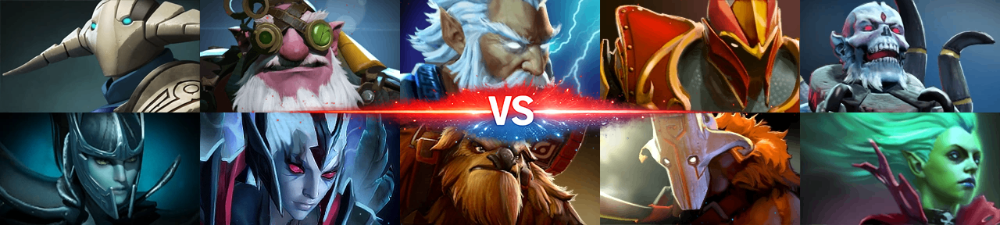

# Collage of Confrontation

> Spring Boot microservice that generates a **Dota 2 hero matchup collage** from a JSON team lineup.



---

## How It Works

1. Client sends a JSON with two teams — **Dire** and **Radiant** — each containing up to 5 hero names.
2. The service loads hero images from `resources/images/characters/`.
3. Heroes are arranged in a 2×5 grid (Dire on top, Radiant on bottom).
4. A PNG mask (`Mask.png`) is overlaid on top of the composed grid.
5. The final `1280×288px` PNG is returned in the response body.

---

## Collage Layout

```
┌──────────┬──────────┬──────────┬──────────┬──────────┐
│  Dire 1  │  Dire 2  │  Dire 3  │  Dire 4  │  Dire 5  │  ← row 0 (top)
├──────────┼──────────┼──────────┼──────────┼──────────┤
│Radiant 1 │Radiant 2 │Radiant 3 │Radiant 4 │Radiant 5 │  ← row 1 (bottom)
└──────────┴──────────┴──────────┴──────────┴──────────┘
                    1280 × 288 px total
                each hero cell: 256 × 144 px
```

---

## Project Structure

```
src/main/
├── java/com/collage/d2/
│   ├── controller/
│   │   └── CollageController.java
│   ├── dto/
│   │   └── TeamRequest.java
│   ├── exception/
│   │   └── GlobalExceptionHandler.java
│   └── service/
│       ├── CollageComposer.java
│       ├── CollageService.java
│       └── ImageLoader.java
└── resources/
    ├── images/
    │   ├── characters/        ← hero PNG files (e.g. "Dragon Knight.png")
    │   ├── Mask.png           ← overlay mask (1280×288, transparent bg)
    │   └── default.png        ← fallback image for any missing slot
    ├── output.png             ← example collage output
    ├── request_example.http   ← HTTP request example
    └── request_example.json   ← JSON payload example
```

---

## API

### `POST /api/collage`

|                  | Media Type         |
|------------------|--------------------|
| **Content-Type** | `application/json` |
| **Produces**     | `image/png`        |

#### Request Body

```json
[
  {
    "team": "Dire",
    "characters": [
      "Sven",
      "Sniper",
      "Zeus",
      "Dragon Knight",
      "Lich"
    ]
  },
  {
    "team": "Radiant",
    "characters": [
      "Phantom Assassin",
      "Vengeful Spirit",
      "Earthshaker",
      "Juggernaut",
      "Death Prophet"
    ]
  }
]
```

Both fields — `team` and `characters` — are optional. The service applies graceful fallback for any missing or invalid
data (see Fallback Logic below).

See [`request_example.http`](src/main/resources/request_example.http) and [
`request_example.json`](src/main/resources/request_example.json) for ready-to-use examples.

#### Response

| Status                      | Description                                       |
|-----------------------------|---------------------------------------------------|
| `200 OK`                    | PNG binary image                                  |
| `400 Bad Request`           | Malformed JSON or field-level validation error    |
| `500 Internal Server Error` | `default.png` not found or image encoding failure |

### `POST /api/collage/base64`

- The request returns a base 64-encoded image as text. It accepts data in the same format as in request
  `POST /api/collage`.

|                  | Media Type         |
|------------------|--------------------|
| **Content-Type** | `application/json` |
| **Produces**     | `text/plain`       |

#### Response

| Status                      | Description                                       |
|-----------------------------|---------------------------------------------------|
| `200 OK`                    | base 64-encoded image                             |
| `400 Bad Request`           | Malformed JSON or field-level validation error    |
| `500 Internal Server Error` | `default.png` not found or image encoding failure |

---

## Fallback Logic

The service never returns an error due to missing or incomplete team data — every unresolvable slot is filled with
`default.png`.

| Situation                                           | Behaviour                                                                     |
|-----------------------------------------------------|-------------------------------------------------------------------------------|
| JSON is empty / no teams provided                   | Both rows → `default.png`                                                     |
| Only one team present                               | Found team loads normally, missing team → `default.png`                       |
| More than 2 teams                                   | `Dire` and `Radiant` entries are used if present, absent ones → `default.png` |
| `team` field is absent, `null`, or blank            | That team is treated as not found → entire row → `default.png`                |
| `characters` field is absent, `null`, or empty list | Entire row for that team → `default.png`                                      |
| More than 5 characters in a team                    | First 5 slots are used, the rest are ignored                                  |
| Fewer than 5 characters in a team                   | Available characters load normally, remaining slots → `default.png`           |
| Character name has no matching image file           | That slot → `default.png`, processing continues                               |
| `default.png` itself not found                      | `500 Internal Server Error`                                                   |

---

## Image Naming Convention

Hero image filenames must match the hero names passed in the JSON **exactly** (case-sensitive), with spaces preserved:

```
characters/
├── Sven.png
├── Dragon Knight.png
├── Phantom Assassin.png
└── ...
```

---

## Running Locally

### Prerequisites

- Java 21+
- Maven 3.8+

### Build & Run

```bash
mvn clean package -DskipTests
java -jar target/collage_of_confrontation-*.jar
```

### Docker

```bash
docker compose up --build -d
```

Service will be available at `http://localhost:8080`.

### cURL Example

```bash
 curl -X POST http://localhost:8080/api/collage 
  -H "Content-Type: application/json" 
  -d '[{"team":"Dire","characters":["Sven","Sniper","Zeus","Dragon Knight","Lich"]},{"team":"Radiant","characters":["Phantom Assassin","Vengeful Spirit","Earthshaker","Juggernaut","Death Prophet"]}]' 
  --output collage.png
```